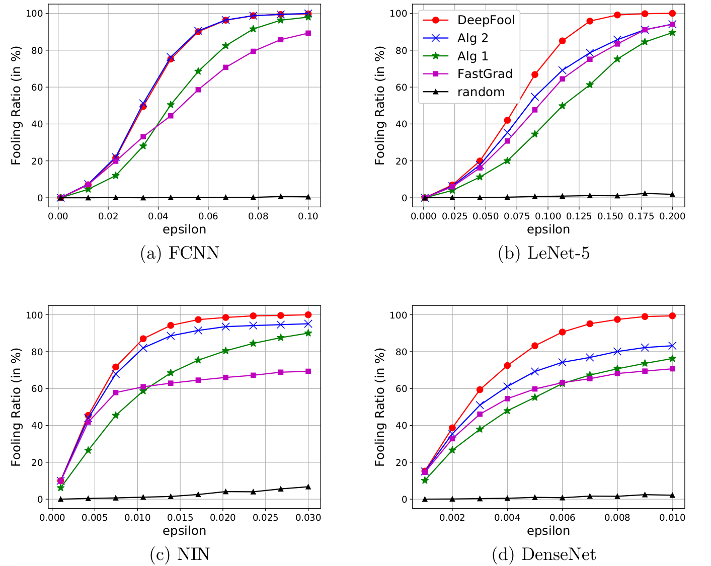

# Generating Adversarial Examples using Convex Programming in tensorflow
This repository contains the tensorflow implementation of our paper: [On Generation of Adversarial Examples using Convex Programming](https://arxiv.org/abs/1803.03607).

Citation:

     @article{balda2017adversarialconvex,
          title={On Generation of Adversarial Examples using Convex Programming},
          author={Balda, Emilio Rafael and Behboodi, Arash and Mathar, Rudolf},
          journal={arXiv preprint	arXiv:1803.03607},
          year={2018}
      }

## Dependencies:

+ Python 3
+ TensorFlow >= 1.4

## Pre-trained models

For benchmarking we use the following pre-trained models and datasets:

* **MNIST dataset**: A fully connected network with two hidden layers of size $150$ and $100$ respectively (test error = 1.7\%), as well as the LeNet-$5$ architecture (test error = 0.9\%).
* **CIFAR-10 dataset**:  The Network In Network (NIN) architecture (test error = 13.8\%), and a $40$ layer DenseNet (test error = 5.2\%).

## Usage

There are 3 main scripts: `main.py`, `view_grahp.py`, and `get_example_images.py`.

### Visualize the graph of a pre-trained model

To create the visualization files (needed by tensorboard) for a pre-trained model, stored by default in ./pretrainedmodels/, use `view_grahp.py`. For example:
``
python view_grahp.py --model2load=lenet
``

### Compute the fooling ratio

To compute the fooling ratio using the pretrained models use `main.py`. For example:

```
python main.py --model2load=fcnn --n-images=1024 --max-epsilon=0.1
```
```
python main.py --model2load=fcnn --n-images=1024 --max-epsilon=0.2
```
```
python main.py --model2load=fcnn --n-images=1024 --max-epsilon=0.03
```
```
python main.py --model2load=fcnn --n-images=1024 --max-epsilon=0.01
```


These figures are stored in ./figures/ by default, the values that appear in these figrues are stored by default in ./results/ as csv files. To customize the loading/storing directories teake a look at 
```
python main.py --help
```

### Compute the robustness measures of a given classifier

For this use the `--rho-mode` option of `main.py`. For example:
```
python main.py --rho-mode --model2load=fcnn --n-images=2048
```
```
python main.py --rho-mode --model2load=lenet --n-images=2048
```
```
python main.py --rho-mode --model2load=nin --n-images=2048
```
or
```
python main.py --rho-mode --model2load=densenet --n-images=2048
```

The obtained values of the robustness metrics are stored in ./results/ by default. 

### Get example images

To add example images into ./examples/ you may use `get_example_images.py`. See 
``
python get_example_images.py --help 
``
for more information.

## Questions?

Please drop [me](http://ti.rwth-aachen.de/staff/page.php?user=Emilio%20Balda) an e-mail if you have any questions!
